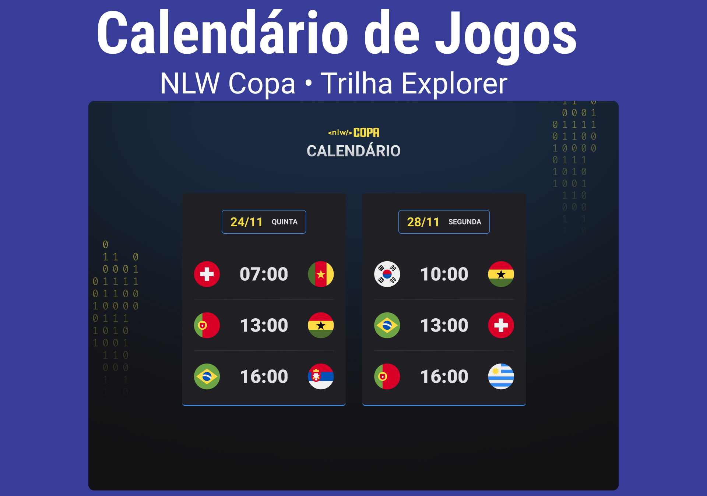

<h1 align="center"> NLW Copa 2022 </h1>

Para ver o projeto final rodando, clique no link: https://nlw-copa-calendario.vercel.app/  
Evento exclusivo e gratuito, promovido pela Rocketseat para ensino de tecnologias WEB.  

  <a href="#-tecnologias">Tecnologias</a>&nbsp;&nbsp;&nbsp;|&nbsp;&nbsp;&nbsp;
  <a href="#-projeto">Projeto</a>&nbsp;&nbsp;&nbsp;|&nbsp;&nbsp;&nbsp;
  <a href="#memo-licença">Licença</a>

  

 

  

## 🚀 Tecnologias

Esse projeto foi desenvolvido com as seguintes tecnologias:

- HTML e CSS
- JavaScript 
- Git e Github

## 💻 Projeto

O calendário da copa é uma projeto onde mostra os dias, horarios e os confrontos da Copa de 2022.

## :memo: Licença

Esse projeto está sob a licença MIT.

---
